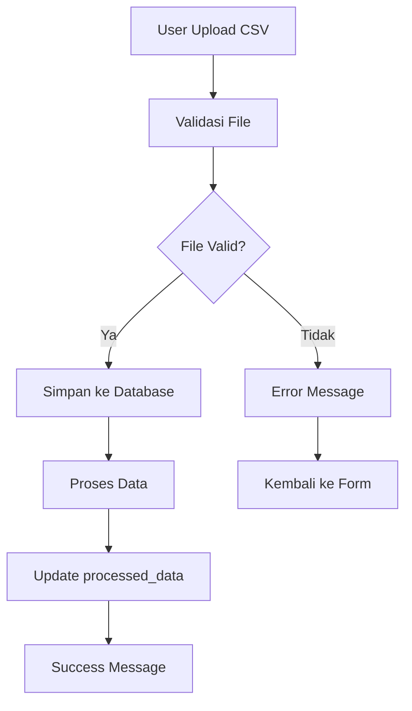
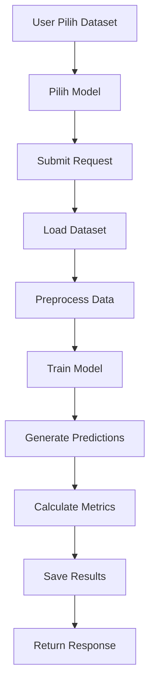
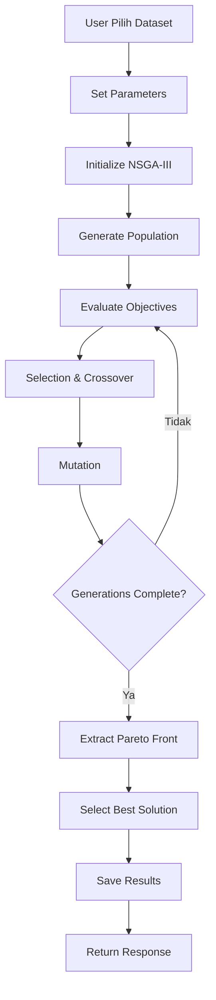
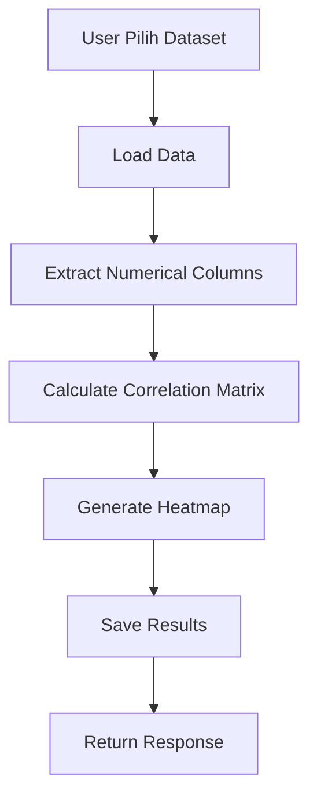

# FishCast AI - Dokumentasi Lengkap Aplikasi

## Daftar Isi
1. [Pendahuluan](#pendahuluan)
2. [Arsitektur Sistem](#arsitektur-sistem)
3. [Struktur Database](#struktur-database)
4. [Alur Aplikasi](#alur-aplikasi)
5. [Komponen Frontend](#komponen-frontend)
6. [API Endpoints](#api-endpoints)
7. [Machine Learning Pipeline](#machine-learning-pipeline)
8. [Cara Penggunaan](#cara-penggunaan)
9. [Troubleshooting](#troubleshooting)
10. [Pengembangan Selanjutnya](#pengembangan-selanjutnya)

---

## Pendahuluan

FishCast AI adalah aplikasi web yang menggabungkan dashboard interaktif dengan API untuk analisis data perikanan menggunakan machine learning. Aplikasi ini dirancang untuk membantu peneliti dan praktisi perikanan dalam melakukan prediksi, optimisasi, dan analisis korelasi data perikanan.

### Fitur Utama:
- **Dashboard Interaktif**: Interface web yang user-friendly
- **Upload Dataset**: Kemampuan untuk mengunggah file CSV
- **Prediksi Multi-Model**: Linear Regression, LSTM, GRU, BiLSTM, RNN
- **Optimisasi NSGA-III**: Multi-objective optimization
- **Analisis Korelasi**: Visualisasi matriks korelasi
- **API RESTful**: Endpoint untuk integrasi dengan aplikasi lain

---

## Arsitektur Sistem

### Tech Stack:
- **Backend**: Django 5.2.4 + Django REST Framework
- **Database**: SQLite (development) / PostgreSQL (production)
- **Frontend**: HTML5, CSS3, JavaScript, Bootstrap 5
- **Charts**: Chart.js
- **Icons**: Font Awesome 6
- **ML Libraries**: Pandas, NumPy (dapat diperluas dengan scikit-learn, TensorFlow)

### Struktur Direktori:
```
backend/
├── api/                    # Django app utama
│   ├── models.py          # Model database
│   ├── views.py           # Views (API + Dashboard)
│   ├── urls.py            # URL routing API
│   ├── serializers.py     # DRF serializers
│   └── ml_models.py       # Machine learning logic
├── fishcast/              # Django project settings
│   ├── settings.py        # Konfigurasi aplikasi
│   └── urls.py            # URL routing utama
├── templates/             # HTML templates
│   ├── base.html          # Template dasar
│   ├── dashboard.html     # Halaman dashboard
│   ├── datasets.html      # Manajemen dataset
│   ├── predictions.html   # Hasil prediksi
│   ├── optimization.html  # Hasil optimisasi
│   └── correlation.html   # Analisis korelasi
├── media/                 # File uploads
├── staticfiles/           # Static files
└── manage.py             # Django management
```

---

## Struktur Database

### Model Database:

#### 1. Dataset Model
```python
class Dataset(models.Model):
    name = models.CharField(max_length=255)           # Nama dataset
    file = models.FileField(upload_to='datasets/')   # File CSV
    uploaded_at = models.DateTimeField(auto_now_add=True)  # Waktu upload
    processed_data = models.JSONField(null=True, blank=True)  # Data yang sudah diproses
    description = models.TextField(blank=True, null=True)  # Deskripsi dataset
```

**Penjelasan:**
- Menyimpan informasi dataset yang diupload
- File disimpan di folder `media/datasets/`
- `processed_data` menyimpan metadata dataset (kolom, shape, sample data)
- Relasi one-to-many dengan Prediction, OptimizationResult, dan CorrelationAnalysis

#### 2. Prediction Model
```python
class Prediction(models.Model):
    MODEL_CHOICES = [
        ('GRU', 'GRU'),
        ('LSTM', 'LSTM'),
        ('BiLSTM', 'BiLSTM'),
        ('Linear', 'Linear Regression'),
        ('RNN', 'RNN'),
    ]
    
    dataset = models.ForeignKey(Dataset, on_delete=models.CASCADE)
    model_type = models.CharField(max_length=20, choices=MODEL_CHOICES)
    predictions = models.JSONField()      # Hasil prediksi
    actual_values = models.JSONField()    # Nilai aktual
    mse = models.FloatField()            # Mean Squared Error
    mae = models.FloatField()            # Mean Absolute Error
    created_at = models.DateTimeField(auto_now_add=True)
```

**Penjelasan:**
- Menyimpan hasil prediksi dari berbagai model ML
- `predictions` dan `actual_values` disimpan sebagai JSON array
- Metrics (MSE, MAE) untuk evaluasi performa model
- Satu dataset bisa memiliki multiple predictions dengan model berbeda

#### 3. OptimizationResult Model
```python
class OptimizationResult(models.Model):
    dataset = models.ForeignKey(Dataset, on_delete=models.CASCADE)
    solutions = models.JSONField()        # Semua solusi Pareto front
    best_solution = models.JSONField()    # Solusi terbaik
    best_total_stok = models.FloatField() # Total stok terbaik
    best_mse = models.FloatField()        # MSE terbaik
    population_size = models.IntegerField(default=40)
    generations = models.IntegerField(default=100)
    created_at = models.DateTimeField(auto_now_add=True)
```

**Penjelasan:**
- Menyimpan hasil optimisasi multi-objective menggunakan NSGA-III
- `solutions` berisi semua solusi di Pareto front
- `best_solution` adalah solusi yang dipilih sebagai optimal
- Parameter optimisasi (population_size, generations) disimpan

#### 4. CorrelationAnalysis Model
```python
class CorrelationAnalysis(models.Model):
    dataset = models.ForeignKey(Dataset, on_delete=models.CASCADE)
    correlation_matrix = models.JSONField()  # Matriks korelasi
    created_at = models.DateTimeField(auto_now_add=True)
```

**Penjelasan:**
- Menyimpan hasil analisis korelasi antar variabel
- `correlation_matrix` adalah dictionary dengan format `{var1: {var2: corr_value}}`
- Digunakan untuk memahami hubungan antar variabel dalam dataset

---

## Alur Aplikasi

### 1. Alur Upload Dataset



**Detail Proses:**
1. **Upload Form**: User mengisi nama, memilih file CSV, dan deskripsi (opsional)
2. **Validasi**: Sistem mengecek format file dan ukuran
3. **Penyimpanan**: File disimpan di `media/datasets/` dengan nama unik
4. **Pemrosesan**: Data dibaca menggunakan Pandas untuk ekstraksi metadata
5. **Database**: Record baru dibuat di tabel Dataset
6. **Response**: Success message dan redirect ke halaman datasets

### 2. Alur Prediksi



**Detail Proses:**
1. **Dataset Selection**: User memilih dataset dari dropdown
2. **Model Selection**: User memilih satu atau lebih model (Linear, LSTM, GRU, dll)
3. **Data Loading**: Sistem membaca file CSV menggunakan Pandas
4. **Preprocessing**: 
   - Handling missing values
   - Feature scaling/normalization
   - Train-test split
5. **Model Training**: Setiap model yang dipilih dilatih secara paralel
6. **Prediction**: Generate predictions untuk test set
7. **Evaluation**: Hitung MSE dan MAE
8. **Storage**: Simpan hasil ke database
9. **Response**: Return success message dengan link ke hasil

### 3. Alur Optimisasi



**Detail Proses:**
1. **Parameter Setting**: User set population_size dan generations
2. **Initialization**: Inisialisasi populasi dengan random solutions
3. **Objective Functions**: 
   - Maximize total_stok
   - Minimize MSE
4. **Evolution**: 
   - Selection menggunakan tournament selection
   - Crossover untuk menghasilkan offspring
   - Mutation untuk diversity
5. **Pareto Front**: Ekstrak semua non-dominated solutions
6. **Best Solution**: Pilih solusi berdasarkan preference
7. **Storage**: Simpan semua solutions dan best solution

### 4. Alur Analisis Korelasi



**Detail Proses:**
1. **Data Loading**: Baca dataset menggunakan Pandas
2. **Column Filtering**: Ambil hanya kolom numerik
3. **Correlation Calculation**: Hitung Pearson correlation coefficient
4. **Matrix Generation**: Buat matriks korelasi NxN
5. **Visualization**: Generate heatmap menggunakan Chart.js
6. **Storage**: Simpan correlation matrix sebagai JSON
7. **Response**: Return correlation data dan visualization

---

## Komponen Frontend

### 1. Base Template (`base.html`)

**Fitur:**
- Responsive navigation dengan sidebar
- Bootstrap 5 styling dengan custom CSS
- Font Awesome icons
- Chart.js integration
- Global JavaScript functions

**Komponen:**
- **Navbar**: Logo, menu utama, user info
- **Sidebar**: Navigation menu dengan active states
- **Main Content**: Area untuk konten halaman
- **Alerts**: System untuk menampilkan messages
- **Modals**: Reusable modal components

**CSS Variables:**
```css
:root {
    --primary-color: #2c3e50;
    --secondary-color: #3498db;
    --accent-color: #e74c3c;
    --success-color: #27ae60;
    --warning-color: #f39c12;
    --light-bg: #ecf0f1;
    --dark-bg: #2c3e50;
}
```

### 2. Dashboard (`dashboard.html`)

**Komponen:**
- **Statistics Cards**: Total datasets, predictions, optimizations, correlations
- **Recent Activities**: Tabel aktivitas terbaru
- **Quick Actions**: Button untuk aksi cepat

**JavaScript Functions:**
- `viewDataset(datasetId)`: Navigate ke detail dataset
- `viewPrediction(predictionId)`: Navigate ke detail prediction
- Auto-refresh setiap 30 detik

### 3. Datasets Page (`datasets.html`)

**Fitur:**
- **Upload Modal**: Form untuk upload dataset
- **Dataset Table**: Daftar semua dataset dengan actions
- **Action Buttons**: View, Predict, Optimize, Correlate, Delete

**JavaScript Functions:**
- `uploadForm`: Handle file upload dengan FormData
- `runPrediction(datasetId)`: Trigger prediction API
- `runOptimization(datasetId)`: Trigger optimization API
- `runCorrelation(datasetId)`: Trigger correlation API
- `deleteDataset(datasetId)`: Delete dataset dengan konfirmasi

### 4. Predictions Page (`predictions.html`)

**Fitur:**
- **Prediction Modal**: Form untuk run prediction
- **Results Table**: Daftar hasil prediksi
- **Chart Modal**: Visualisasi hasil prediksi

**JavaScript Functions:**
- `showChart(predictionId)`: Display prediction chart
- `exportPrediction(predictionId)`: Export hasil ke CSV
- Chart.js integration untuk line chart

### 5. Optimization Page (`optimization.html`)

**Fitur:**
- **Optimization Modal**: Form dengan parameter NSGA-III
- **Results Table**: Daftar hasil optimisasi
- **Pareto Front Chart**: Scatter plot solutions

**JavaScript Functions:**
- `showOptimizationChart(optimizationId)`: Display Pareto front
- Scatter plot dengan Chart.js untuk multi-objective visualization

### 6. Correlation Page (`correlation.html`)

**Fitur:**
- **Correlation Modal**: Form untuk run analysis
- **Results Table**: Daftar hasil analisis
- **Heatmap Modal**: Visualisasi correlation matrix

**JavaScript Functions:**
- `showCorrelationMatrix(correlationId)`: Display heatmap
- Color-coded correlation values (green=positive, red=negative)

---

## API Endpoints

### Base URL: `http://localhost:8001/api/`

### 1. Health Check
```
GET /api/health/
Response: {"status": "healthy"}
```

### 2. Dataset Endpoints

#### List Datasets
```
GET /api/datasets/
Response: [{"id": 1, "name": "dataset1", "uploaded_at": "2024-01-01T00:00:00Z", ...}]
```

#### Upload Dataset
```
POST /api/datasets/
Content-Type: multipart/form-data
Body: {
    "name": "Dataset Name",
    "file": <CSV file>,
    "description": "Optional description"
}
Response: {"id": 1, "name": "Dataset Name", ...}
```

#### Get Dataset Detail
```
GET /api/datasets/{id}/
Response: {"id": 1, "name": "dataset1", "file": "path/to/file.csv", ...}
```

#### Delete Dataset
```
DELETE /api/datasets/{id}/
Response: 204 No Content
```

### 3. Prediction Endpoints

#### Run Prediction
```
POST /api/predict/
Content-Type: application/json
Body: {
    "dataset_id": 1,
    "models": ["Linear", "LSTM", "GRU"]
}
Response: {"message": "Prediction started successfully"}
```

#### List Predictions
```
GET /api/predictions/
Response: [{"id": 1, "model_type": "Linear", "mse": 0.1234, ...}]
```

#### Get Prediction Detail
```
GET /api/predictions/{id}/
Response: {
    "id": 1,
    "model_type": "Linear",
    "predictions": [1.2, 1.3, 1.4, ...],
    "actual_values": [1.1, 1.2, 1.3, ...],
    "mse": 0.1234,
    "mae": 0.0987
}
```

### 4. Optimization Endpoints

#### Run Optimization
```
POST /api/optimize/
Content-Type: application/json
Body: {
    "dataset_id": 1,
    "population_size": 40,
    "generations": 100
}
Response: {"message": "Optimization started successfully"}
```

#### List Optimization Results
```
GET /api/optimization-results/
Response: [{"id": 1, "best_total_stok": 1000.5, "best_mse": 0.1234, ...}]
```

#### Get Optimization Detail
```
GET /api/optimization-results/{id}/
Response: {
    "id": 1,
    "solutions": [{"total_stok": 1000.5, "mse": 0.1234}, ...],
    "best_solution": {"total_stok": 1000.5, "mse": 0.1234},
    "best_total_stok": 1000.5,
    "best_mse": 0.1234
}
```

### 5. Correlation Endpoints

#### Run Correlation Analysis
```
POST /api/correlation/
Content-Type: application/json
Body: {
    "dataset_id": 1
}
Response: {"message": "Correlation analysis started successfully"}
```

#### List Correlation Results
```
GET /api/correlation-results/
Response: [{"id": 1, "dataset": {"name": "dataset1"}, ...}]
```

#### Get Correlation Detail
```
GET /api/correlation-results/{id}/
Response: {
    "id": 1,
    "correlation_matrix": {
        "var1": {"var1": 1.0, "var2": 0.5, "var3": -0.3},
        "var2": {"var1": 0.5, "var2": 1.0, "var3": 0.7},
        "var3": {"var1": -0.3, "var2": 0.7, "var3": 1.0}
    }
}
```

### 6. Export Endpoint

#### Export Prediction Results
```
GET /api/export/{prediction_id}/
Response: CSV file with actual vs predicted values
```

---

## Machine Learning Pipeline

### 1. Data Preprocessing

```python
def preprocess_data(df):
    # Handle missing values
    df = df.fillna(method='ffill')
    
    # Feature scaling
    scaler = StandardScaler()
    numerical_cols = df.select_dtypes(include=[np.number]).columns
    df[numerical_cols] = scaler.fit_transform(df[numerical_cols])
    
    # Train-test split
    train_size = int(len(df) * 0.8)
    train_data = df[:train_size]
    test_data = df[train_size:]
    
    return train_data, test_data, scaler
```

### 2. Model Training

#### Linear Regression
```python
def train_linear_model(X_train, y_train):
    model = LinearRegression()
    model.fit(X_train, y_train)
    return model
```

#### LSTM Model
```python
def create_lstm_model(input_shape):
    model = Sequential([
        LSTM(50, return_sequences=True, input_shape=input_shape),
        LSTM(50, return_sequences=False),
        Dense(25),
        Dense(1)
    ])
    model.compile(optimizer='adam', loss='mean_squared_error')
    return model
```

#### GRU Model
```python
def create_gru_model(input_shape):
    model = Sequential([
        GRU(50, return_sequences=True, input_shape=input_shape),
        GRU(50, return_sequences=False),
        Dense(25),
        Dense(1)
    ])
    model.compile(optimizer='adam', loss='mean_squared_error')
    return model
```

### 3. NSGA-III Optimization

```python
def nsga3_optimization(dataset, population_size=40, generations=100):
    # Define objectives
    def objective1(solution):  # Maximize total_stok
        return calculate_total_stok(solution)
    
    def objective2(solution):  # Minimize MSE
        return calculate_mse(solution)
    
    # Initialize population
    population = initialize_population(population_size)
    
    for generation in range(generations):
        # Evaluate objectives
        objectives = [objective1(population), objective2(population)]
        
        # Non-dominated sorting
        fronts = non_dominated_sort(objectives)
        
        # Selection, crossover, mutation
        offspring = genetic_operators(population)
        
        # Environmental selection
        population = environmental_selection(population, offspring)
    
    return extract_pareto_front(population)
```

### 4. Correlation Analysis

```python
def calculate_correlation_matrix(df):
    # Select numerical columns only
    numerical_df = df.select_dtypes(include=[np.number])
    
    # Calculate correlation matrix
    correlation_matrix = numerical_df.corr()
    
    # Convert to dictionary format
    correlation_dict = correlation_matrix.to_dict()
    
    return correlation_dict
```

---

## Cara Penggunaan

### 1. Setup Development Environment

```bash
# Clone repository
git clone <repository-url>
cd backend

# Create virtual environment
python -m venv venv
source venv/bin/activate  # Linux/Mac
# atau
venv\Scripts\activate  # Windows

# Install dependencies
pip install -r requirements.txt

# Run migrations
python manage.py makemigrations
python manage.py migrate

# Create superuser (optional)
python manage.py createsuperuser

# Run development server
python manage.py runserver 8001
```

### 2. Akses Aplikasi

- **Dashboard**: http://localhost:8001/
- **Admin Panel**: http://localhost:8001/admin/
- **API Base**: http://localhost:8001/api/

### 3. Workflow Penggunaan

#### Step 1: Upload Dataset
1. Buka halaman Datasets
2. Klik "Upload Dataset"
3. Isi nama dataset
4. Pilih file CSV
5. Tambah deskripsi (opsional)
6. Klik "Upload"

#### Step 2: Run Prediction
1. Buka halaman Predictions
2. Klik "Run New Prediction"
3. Pilih dataset
4. Pilih model(s) yang diinginkan
5. Klik "Run Prediction"
6. Tunggu proses selesai
7. Lihat hasil di tabel

#### Step 3: Run Optimization
1. Buka halaman Optimization
2. Klik "Run New Optimization"
3. Pilih dataset
4. Set parameter (population_size, generations)
5. Klik "Run Optimization"
6. Tunggu proses selesai
7. Lihat Pareto front chart

#### Step 4: Run Correlation Analysis
1. Buka halaman Correlation Analysis
2. Klik "Run New Analysis"
3. Pilih dataset
4. Klik "Run Analysis"
5. Lihat correlation matrix heatmap

### 4. Format Dataset

Dataset harus dalam format CSV dengan struktur:
```csv
date,temperature,salinity,ph,dissolved_oxygen,fish_count
2024-01-01,25.5,35.2,7.8,6.2,150
2024-01-02,26.1,34.8,7.9,6.5,165
...
```

**Requirements:**
- Header row dengan nama kolom
- Data numerik untuk analisis
- Minimal 10 baris data
- Maksimal 10MB file size

---

## Troubleshooting

### 1. Common Issues

#### Port Already in Use
```bash
# Kill process on port 8001
sudo lsof -ti:8001 | xargs kill -9

# Atau gunakan port lain
python manage.py runserver 8002
```

#### Database Migration Error
```bash
# Reset migrations
python manage.py migrate api zero
rm api/migrations/0*.py
python manage.py makemigrations
python manage.py migrate
```

#### Static Files Not Loading
```bash
# Collect static files
python manage.py collectstatic
```

#### File Upload Error
- Cek permission folder `media/`
- Pastikan file tidak terlalu besar
- Validasi format CSV

### 2. Debug Mode

Aktifkan debug mode di `settings.py`:
```python
DEBUG = True
```

### 3. Log Files

Cek log Django:
```bash
python manage.py runserver 8001 --verbosity=2
```

### 4. Database Inspection

```bash
# Masuk ke Django shell
python manage.py shell

# Inspect models
from api.models import Dataset, Prediction
Dataset.objects.all()
Prediction.objects.all()
```

---

## Pengembangan Selanjutnya

### 1. Fitur yang Direncanakan

#### Advanced ML Models
- **XGBoost**: Gradient boosting untuk prediksi
- **Random Forest**: Ensemble learning
- **Neural Networks**: Deep learning dengan TensorFlow
- **Time Series Models**: ARIMA, Prophet

#### Enhanced Optimization
- **Multi-objective**: Lebih dari 2 objectives
- **Constraint Handling**: Hard dan soft constraints
- **Interactive Optimization**: User-guided optimization
- **Real-time Optimization**: Live parameter adjustment

#### Data Visualization
- **Interactive Charts**: Plotly.js integration
- **3D Visualization**: Three.js untuk 3D plots
- **Geographic Maps**: Folium untuk spatial data
- **Real-time Dashboard**: WebSocket untuk live updates

#### User Management
- **Authentication**: User login/logout
- **Authorization**: Role-based access control
- **User Profiles**: Personal settings dan preferences
- **Project Management**: Organize datasets by projects

#### API Enhancements
- **GraphQL**: Alternative to REST API
- **WebSocket**: Real-time communication
- **Rate Limiting**: API usage limits
- **API Documentation**: Swagger/OpenAPI

### 2. Performance Improvements

#### Database Optimization
- **Indexing**: Add database indexes
- **Query Optimization**: Optimize database queries
- **Caching**: Redis for caching
- **Database Migration**: PostgreSQL for production

#### Scalability
- **Load Balancing**: Multiple server instances
- **Microservices**: Split into smaller services
- **Containerization**: Docker deployment
- **Cloud Deployment**: AWS, GCP, Azure

#### ML Pipeline Optimization
- **Parallel Processing**: Multi-threading untuk ML
- **GPU Acceleration**: CUDA support
- **Model Caching**: Cache trained models
- **Incremental Learning**: Online learning

### 3. Security Enhancements

#### Data Security
- **Encryption**: Encrypt sensitive data
- **Data Masking**: Anonymize personal data
- **Access Control**: Fine-grained permissions
- **Audit Logging**: Track all data access

#### API Security
- **JWT Authentication**: Token-based auth
- **OAuth2**: Third-party authentication
- **API Keys**: Secure API access
- **HTTPS**: SSL/TLS encryption

### 4. Monitoring & Analytics

#### Application Monitoring
- **Health Checks**: Automated monitoring
- **Performance Metrics**: Response times, throughput
- **Error Tracking**: Sentry integration
- **User Analytics**: Usage patterns

#### ML Model Monitoring
- **Model Performance**: Track model degradation
- **Data Drift**: Monitor data distribution changes
- **A/B Testing**: Compare model versions
- **Model Registry**: Version control for models

---

## Kesimpulan

FishCast AI adalah aplikasi yang menggabungkan kemudahan penggunaan interface web dengan kekuatan machine learning untuk analisis data perikanan. Aplikasi ini menyediakan:

1. **Dashboard Interaktif**: Interface yang user-friendly untuk non-technical users
2. **API RESTful**: Integrasi dengan aplikasi lain
3. **Multi-Model ML**: Berbagai algoritma untuk prediksi
4. **Optimisasi Multi-Objective**: NSGA-III untuk optimisasi
5. **Analisis Korelasi**: Visualisasi hubungan antar variabel
6. **Extensible Architecture**: Mudah untuk menambah fitur baru

Aplikasi ini dirancang dengan prinsip modular dan scalable, sehingga dapat dikembangkan lebih lanjut sesuai kebutuhan pengguna dan bisnis.

---

## Kontak & Support

Untuk pertanyaan atau dukungan teknis:
- **Email**: support@fishcast.ai
- **Documentation**: https://docs.fishcast.ai
- **GitHub**: https://github.com/fishcast-ai
- **Issues**: https://github.com/fishcast-ai/issues

---

*Dokumentasi ini dibuat pada: 2024-01-15*
*Versi Aplikasi: 1.0.0*
*Django Version: 5.2.4* 