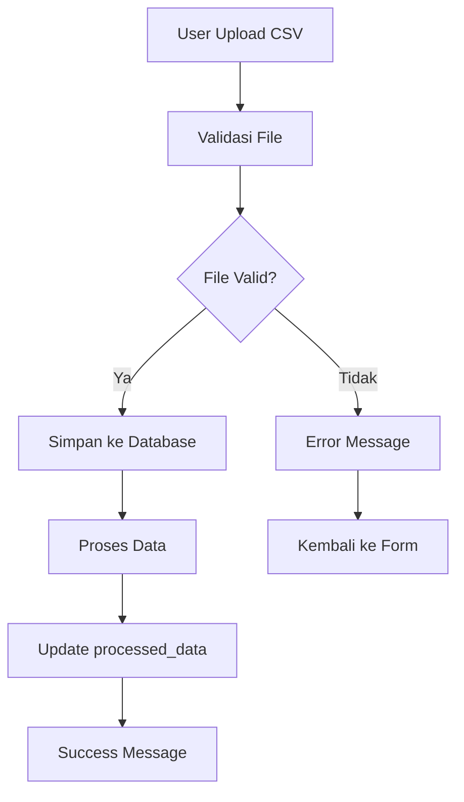
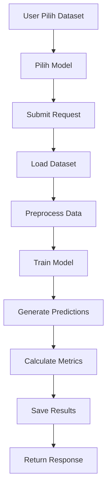
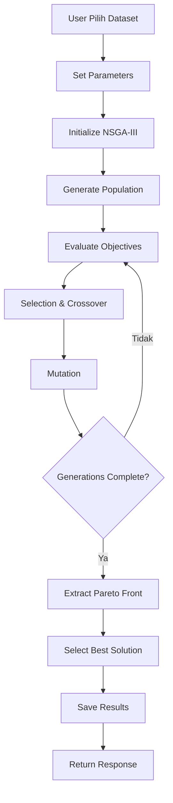
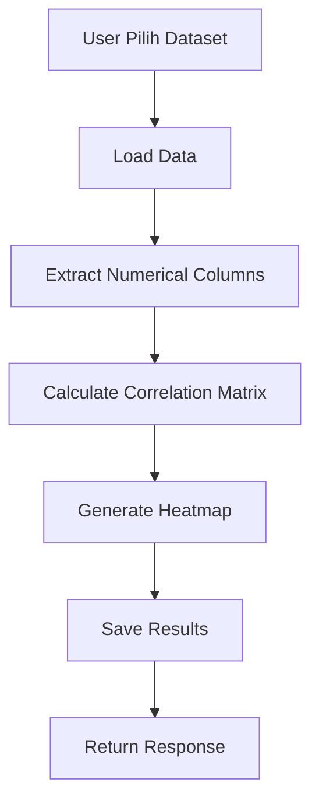

# FishCast AI - Dokumentasi Lengkap Aplikasi (Bagian 1)

## Daftar Isi
1. [Pendahuluan](#pendahuluan)
2. [Arsitektur Sistem](#arsitektur-sistem)
3. [Struktur Database](#struktur-database)
4. [Alur Aplikasi](#alur-aplikasi)

---

## Pendahuluan

FishCast AI adalah aplikasi web yang menggabungkan dashboard interaktif dengan API untuk analisis data perikanan menggunakan machine learning. Aplikasi ini dirancang untuk membantu peneliti dan praktisi perikanan dalam melakukan prediksi, optimisasi, dan analisis korelasi data perikanan.

### Fitur Utama:
- **Dashboard Interaktif**: Interface web yang user-friendly
- **Upload Dataset**: Kemampuan untuk mengunggah file CSV
- **Prediksi Multi-Model**: Linear Regression, LSTM, GRU, BiLSTM, RNN
- **Optimisasi NSGA-III**: Multi-objective optimization
- **Analisis Korelasi**: Visualisasi matriks korelasi
- **API RESTful**: Endpoint untuk integrasi dengan aplikasi lain

### Tech Stack:
- **Backend**: Django 5.2.4 + Django REST Framework
- **Database**: SQLite (development) / PostgreSQL (production)
- **Frontend**: HTML5, CSS3, JavaScript, Bootstrap 5
- **Charts**: Chart.js
- **Icons**: Font Awesome 6
- **ML Libraries**: Pandas, NumPy (dapat diperluas dengan scikit-learn, TensorFlow)

---

## Arsitektur Sistem

### Struktur Direktori:
```
backend/
├── api/                    # Django app utama
│   ├── models.py          # Model database
│   ├── views.py           # Views (API + Dashboard)
│   ├── urls.py            # URL routing API
│   ├── serializers.py     # DRF serializers
│   └── ml_models.py       # Machine learning logic
├── fishcast/              # Django project settings
│   ├── settings.py        # Konfigurasi aplikasi
│   └── urls.py            # URL routing utama
├── templates/             # HTML templates
│   ├── base.html          # Template dasar
│   ├── dashboard.html     # Halaman dashboard
│   ├── datasets.html      # Manajemen dataset
│   ├── predictions.html   # Hasil prediksi
│   ├── optimization.html  # Hasil optimisasi
│   └── correlation.html   # Analisis korelasi
├── media/                 # File uploads
├── staticfiles/           # Static files
└── manage.py             # Django management
```

### Komponen Utama:

#### 1. Django Backend
- **Models**: Definisi struktur database
- **Views**: Logic aplikasi (API + Dashboard)
- **URLs**: Routing untuk API dan web interface
- **Serializers**: Konversi data untuk API

#### 2. Frontend Templates
- **Base Template**: Layout dasar dengan navigation
- **Dashboard**: Overview dan statistics
- **CRUD Pages**: Create, Read, Update, Delete operations
- **Modal Forms**: Interactive forms untuk user input

#### 3. JavaScript Integration
- **AJAX Calls**: Komunikasi dengan API
- **Chart.js**: Visualisasi data
- **Bootstrap**: UI components dan styling
- **Form Handling**: Dynamic form submission

---

## Struktur Database

### Model Database:

#### 1. Dataset Model
```python
class Dataset(models.Model):
    name = models.CharField(max_length=255)           # Nama dataset
    file = models.FileField(upload_to='datasets/')   # File CSV
    uploaded_at = models.DateTimeField(auto_now_add=True)  # Waktu upload
    processed_data = models.JSONField(null=True, blank=True)  # Data yang sudah diproses
    description = models.TextField(blank=True, null=True)  # Deskripsi dataset
```

**Penjelasan:**
- Menyimpan informasi dataset yang diupload
- File disimpan di folder `media/datasets/`
- `processed_data` menyimpan metadata dataset (kolom, shape, sample data)
- Relasi one-to-many dengan Prediction, OptimizationResult, dan CorrelationAnalysis

#### 2. Prediction Model
```python
class Prediction(models.Model):
    MODEL_CHOICES = [
        ('GRU', 'GRU'),
        ('LSTM', 'LSTM'),
        ('BiLSTM', 'BiLSTM'),
        ('Linear', 'Linear Regression'),
        ('RNN', 'RNN'),
    ]
    
    dataset = models.ForeignKey(Dataset, on_delete=models.CASCADE)
    model_type = models.CharField(max_length=20, choices=MODEL_CHOICES)
    predictions = models.JSONField()      # Hasil prediksi
    actual_values = models.JSONField()    # Nilai aktual
    mse = models.FloatField()            # Mean Squared Error
    mae = models.FloatField()            # Mean Absolute Error
    created_at = models.DateTimeField(auto_now_add=True)
```

**Penjelasan:**
- Menyimpan hasil prediksi dari berbagai model ML
- `predictions` dan `actual_values` disimpan sebagai JSON array
- Metrics (MSE, MAE) untuk evaluasi performa model
- Satu dataset bisa memiliki multiple predictions dengan model berbeda

#### 3. OptimizationResult Model
```python
class OptimizationResult(models.Model):
    dataset = models.ForeignKey(Dataset, on_delete=models.CASCADE)
    solutions = models.JSONField()        # Semua solusi Pareto front
    best_solution = models.JSONField()    # Solusi terbaik
    best_total_stok = models.FloatField() # Total stok terbaik
    best_mse = models.FloatField()        # MSE terbaik
    population_size = models.IntegerField(default=40)
    generations = models.IntegerField(default=100)
    created_at = models.DateTimeField(auto_now_add=True)
```

**Penjelasan:**
- Menyimpan hasil optimisasi multi-objective menggunakan NSGA-III
- `solutions` berisi semua solusi di Pareto front
- `best_solution` adalah solusi yang dipilih sebagai optimal
- Parameter optimisasi (population_size, generations) disimpan

#### 4. CorrelationAnalysis Model
```python
class CorrelationAnalysis(models.Model):
    dataset = models.ForeignKey(Dataset, on_delete=models.CASCADE)
    correlation_matrix = models.JSONField()  # Matriks korelasi
    created_at = models.DateTimeField(auto_now_add=True)
```

**Penjelasan:**
- Menyimpan hasil analisis korelasi antar variabel
- `correlation_matrix` adalah dictionary dengan format `{var1: {var2: corr_value}}`
- Digunakan untuk memahami hubungan antar variabel dalam dataset

---

## Alur Aplikasi

### 1. Alur Upload Dataset



**Detail Proses:**
1. **Upload Form**: User mengisi nama, memilih file CSV, dan deskripsi (opsional)
2. **Validasi**: Sistem mengecek format file dan ukuran
3. **Penyimpanan**: File disimpan di `media/datasets/` dengan nama unik
4. **Pemrosesan**: Data dibaca menggunakan Pandas untuk ekstraksi metadata
5. **Database**: Record baru dibuat di tabel Dataset
6. **Response**: Success message dan redirect ke halaman datasets

### 2. Alur Prediksi



**Detail Proses:**
1. **Dataset Selection**: User memilih dataset dari dropdown
2. **Model Selection**: User memilih satu atau lebih model (Linear, LSTM, GRU, dll)
3. **Data Loading**: Sistem membaca file CSV menggunakan Pandas
4. **Preprocessing**: 
   - Handling missing values
   - Feature scaling/normalization
   - Train-test split
5. **Model Training**: Setiap model yang dipilih dilatih secara paralel
6. **Prediction**: Generate predictions untuk test set
7. **Evaluation**: Hitung MSE dan MAE
8. **Storage**: Simpan hasil ke database
9. **Response**: Return success message dengan link ke hasil

### 3. Alur Optimisasi



**Detail Proses:**
1. **Parameter Setting**: User set population_size dan generations
2. **Initialization**: Inisialisasi populasi dengan random solutions
3. **Objective Functions**: 
   - Maximize total_stok
   - Minimize MSE
4. **Evolution**: 
   - Selection menggunakan tournament selection
   - Crossover untuk menghasilkan offspring
   - Mutation untuk diversity
5. **Pareto Front**: Ekstrak semua non-dominated solutions
6. **Best Solution**: Pilih solusi berdasarkan preference
7. **Storage**: Simpan semua solutions dan best solution

### 4. Alur Analisis Korelasi



**Detail Proses:**
1. **Data Loading**: Baca dataset menggunakan Pandas
2. **Column Filtering**: Ambil hanya kolom numerik
3. **Correlation Calculation**: Hitung Pearson correlation coefficient
4. **Matrix Generation**: Buat matriks korelasi NxN
5. **Visualization**: Generate heatmap menggunakan Chart.js
6. **Storage**: Simpan correlation matrix sebagai JSON
7. **Response**: Return correlation data dan visualization

---

*Lanjut ke bagian 2 untuk detail komponen frontend dan API endpoints...* 